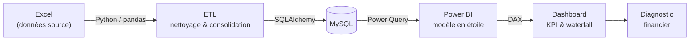
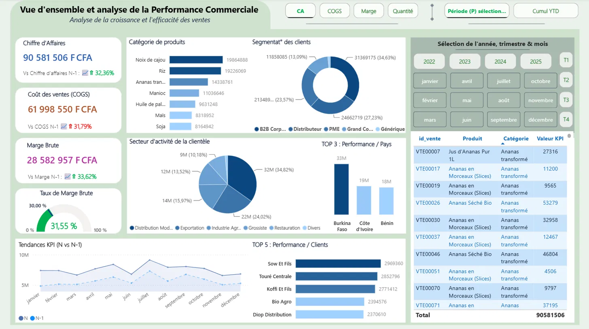
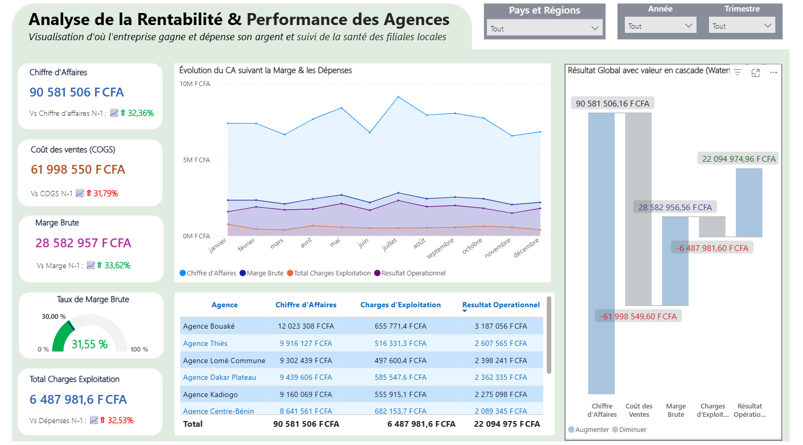

# Projet Négoce Agro-Industriel — Diagnostic & Dashboard de Pilotage Financier

**Fiabilisation d'un pipeline de données et analyse de la performance financière d'un groupe agro-industriel ouest-africain**

Préparé par **Hervé Goutolou** — Consultant en finance d'entreprise & Financial Data Analyst

---

## 📌 Contexte du projet

Projet Négoce Agro-Industriel est un cas d'étude de pilotage décisionnel pour la direction financière et générale d'une entreprise agro-alimentaire et agro-industrielle d'Afrique de l'Ouest. L'objectif : livrer un dashboard Power BI fiable, couvrant la performance commerciale, la rentabilité opérationnelle et la maîtrise des charges d'exploitation, structuré autour de l'enchaînement :

```
Chiffre d'Affaires → Coût des Ventes → Marge Brute → Charges d'Exploitation → Résultat Opérationnel
```

Ce projet illustre une double compétence : **fiabiliser un pipeline de données de bout en bout** (Excel → Python/ETL → MySQL → Power BI) et **produire une analyse financière actionnable** à partir de ces données.

> ⚠️ Jeu de données **fictif**, construit intentionnellement (y compris ses anomalies de qualité) à des fins de démonstration et d'entraînement. Aucune donnée réelle d'entreprise n'est utilisée.

## 🏗️ Architecture du pipeline



## 🛠️ Stack technique


Pipeline : **Excel (source) → Python (ETL) → MySQL → Power BI (modèle + mesures DAX)**

## 📸 Aperçu du dashboard


*Vue d'ensemble commerciale : CA, COGS, marge, segmentation clients, top produits et top pays*


*Cascade CA → Résultat Opérationnel, rentabilité par agence, segments Pays/Région et Période*

---

## 1. Diagnostic qualité du pipeline de données

Avant toute restitution aux décideurs, un contrôle qualité approfondi du pipeline (Excel → Python/ETL → MySQL → modèle Power BI) a été mené. Quatre anomalies structurelles ont été identifiées et corrigées :

|Table concernée|Symptôme observé|Cause racine|Correction apportée|
|-|-|-|-|
|**Fournisseurs**|100 lignes pour 14 fournisseurs réels ; attributs incohérents pour une même entité|Génération d'une nouvelle identité à chaque ligne au lieu de réutiliser les entités existantes|Consolidation par nom de base → 14 fournisseurs uniques + table de liaison Fournisseurs_Produits (65 associations)|
|**Clients**|300 lignes pour 96 clients réels|Même défaut de génération, propagé sur une seconde dimension|Consolidation par nom de base → 96 clients uniques, avec remappage des clés dans Ventes|
|**Ventes / Client générique**|43 ventes (1,48 % du CA) référençant un client inexistant (CLI999) → segment "(Blank)" dans les visuels|Clé étrangère orpheline|Création d'un profil générique "Client Standard Divers" : CA total préservé, plus aucun segment vide|
|**Relation Agences ↔ Ventes**|Sélection d'un pays : CA, COGS et Marge Brute passaient à vide sur la page Rentabilité|Relation manquante / inactive dans le modèle Power BI|Relation Agences (1) → Ventes (*) rétablie et activée sur `id_agence`|

### Validation de cohérence post-correction

Les mesures DAX ont été extraites et les indicateurs recalculés **indépendamment en Python** à partir des données réellement chargées dans le modèle, pour confirmer l'absence d'écart entre la logique du modèle et les valeurs affichées :

|Indicateur|Valeur (dashboard)|Recalcul indépendant|Statut|
|-|-|-|-|
|Chiffre d'Affaires|90 581 506 F CFA|90 581 506 F CFA|✅ OK|
|Coût des Ventes (COGS)|61 998 550 F CFA|61 998 550 F CFA|✅ OK|
|Marge Brute (31,55 %)|28 582 957 F CFA|28 582 957 F CFA|✅ OK|
|Charges d'Exploitation|6 487 982 F CFA|6 487 982 F CFA|✅ OK|
|Résultat Opérationnel (24,39 % du CA)|22 094 975 F CFA|22 094 975 F CFA|✅ OK|

Les totaux des pages "Performance Commerciale" et "Rentabilité" sont strictement identiques — confirmation que le modèle est désormais unifié, sans rupture de relation.

### Points de vigilance identifiés

* **Cible de marge en dur** : la mesure Taux de Marge Cible est fixée à 30 % alors que le cadrage métier définit une fourchette de 25 %–35 %. Une bande cible (min/max) refléterait mieux l'objectif réel.
* **Relation Dépenses ↔ Agences par le texte** : appariement sur le nom d'agence (colonne texte) plutôt que sur un ID — saine à ce jour (10/10 agences bien appariées) mais fragile face à une future saisie manuelle.
* **Portée limitée de "Rotation des Stocks"** : cette mesure ne réagit pas aux segments Pays/Agence/Client du rapport, à signaler aux utilisateurs.

---

## 2. Analyse de la performance financière (2022–2025)

### Synthèse exécutive

Sur la période 2022–2025, Projet Négoce Agro-Industriel affiche une marge brute stable et conforme à la cible stratégique du groupe (25 %–35 %), à 31,55 % en cumul. Trois points méritent l'attention de la direction : un retournement de croissance en 2025 après deux années de forte expansion, une rentabilité géographique inégale, et une structure de charges très concentrée sur la masse salariale (47 % des charges d'exploitation).

### Tendance pluriannuelle : un retournement de croissance en 2025

|Exercice|CA (F CFA)|Évol. CA|Marge Brute %|Résultat Opér.|RO % du CA|
|-|-|-|-|-|-|
|2022|19 445 889|—|30,8 %|4 231 173|22,0 %|
|2023|24 137 408|**+24,1 %**|31,2 %|5 898 047|24,4 %|
|2024|24 851 251|+3,0 %|31,7 %|6 367 100|25,6 %|
|**2025**|**22 146 958**|**-10,9 %**|**32,5 %**|5 598 654|25,3 %|

Après deux années de forte expansion, le CA recule de -10,9 % en 2025 — première année de baisse de la période. Point rassurant : le taux de marge brute continue de progresser (32,5 %, son meilleur niveau), signe d'une discipline de coûts qui amortit partiellement le choc de volume. Le résultat opérationnel recule néanmoins de -12,1 %, la baisse de charges (-1,7 %) ne compensant pas la perte de chiffre d'affaires.

**Recommandation** : investiguer la cause du repli 2025 (perte de clients, effet prix/concurrence, rupture d'approvisionnement) avant qu'il ne s'installe.

### Rentabilité par gamme de produits : l'écart Négoce / Transformation ne se vérifie pas

Le modèle économique du groupe repose sur l'hypothèse que la transformation agro-industrielle dégage des marges plus fortes que le négoce de matières brutes. Les données ne confirment pas cette hypothèse :

|Produit|Version brute|Version transformée|Écart|
|-|-|-|-|
|Maïs|Grain : 37,4 %|Semoule : 34,1 %|-3,3 pt|
|Manioc|Racine : 36,4 %|Transformé : 34,5 %|-1,9 pt|
|Noix de cajou|Brute : 29,9 %|Transformée : 29,6 %|-0,3 pt|
|Huile de palme|Brute : 29,9 %|Raffinée : 27,5 %|-2,4 pt|

C'est le point le plus actionnable du diagnostic : soit la valorisation des coûts de transformation est sous-évaluée dans le système de gestion, soit la transformation ne capte pas encore la prime de valeur ajoutée attendue sur le marché — un axe de repricing potentiellement prioritaire.

### Rentabilité géographique : le marché domestique est le moins rentable

|Pays|CA|Marge Brute|Charges Expl.|Résultat Opér.|RO % CA|
|-|-|-|-|-|-|
|Togo|9 302 439|2 895 841|497 600|2 398 241|**25,8 %**|
|Sénégal|19 355 733|6 071 779|1 101 879|4 969 900|25,7 %|
|Burkina Faso|17 666 233|5 542 800|1 188 592|4 354 208|24,6 %|
|Côte d'Ivoire|27 814 405|8 892 078|2 231 676|6 660 402|23,9 %|
|**Bénin (siège)**|16 442 697|5 180 459|1 468 235|3 712 224|**22,6 %**|

La Côte d'Ivoire est le premier marché en CA (31 % du total) mais se classe en avant-dernière position en rentabilité. Plus notable : le Bénin, marché domestique et siège du groupe, est le pays le moins rentable de la zone — écart de 3,2 points avec le Togo, le plus performant. Au niveau des agences, l'écart atteint plus de 6 points de RO/CA entre la meilleure (Bouaké, 26,5 %) et la moins bonne (Abidjan Nord, 20,3 %).

### Structure des charges d'exploitation

|Catégorie de charge|Montant (F CFA)|% du total|
|-|-|-|
|**Salaires**|3 059 884|**47,2 %**|
|Transport|945 875|14,6 %|
|Maintenance|929 844|14,3 %|
|Marketing|866 088|13,3 %|
|Carburant|180 442|2,8 %|
|Télécommunications|173 897|2,7 %|
|Assurances|169 649|2,6 %|
|Électricité|162 304|2,5 %|

La masse salariale concentre près de la moitié des charges d'exploitation — le principal levier de maîtrise des coûts se joue donc sur ce poste plutôt que sur des lignes secondaires.

### Concentration clients / fournisseurs et saisonnalité

* **Clients** : sur 94 clients actifs, les 20 % les plus importants concentrent 43 % du CA ; le Top 10 seulement 26,3 %. Portefeuille raisonnablement diversifié.
* **Fournisseurs** : sur 14 fournisseurs, le premier ne pèse que 12,5 % des achats. Pas de risque de dépendance identifié.
* **Saisonnalité** : pic net en juillet (+21 % vs moyenne), creux en mars et novembre (indice ~87-88) — à anticiper dans la gestion de trésorerie et le pilotage des stocks.

---

## 3. Recommandations à la direction

1. Investiguer sans délai les causes du repli du CA en 2025 (par client, par agence, par produit).
2. Auditer la structure de coûts de la filière Transformation pour comprendre pourquoi elle ne dégage pas la prime de marge attendue par rapport au négoce brut.
3. Analyser les postes de charges des agences les moins rentables (Abidjan Nord/Sud, Littoral Bénin) et diffuser les pratiques de gestion de l'Agence Bouaké et du Togo.
4. Suivre la masse salariale comme poste de pilotage prioritaire (47 % des charges d'exploitation).
5. Intégrer la saisonnalité de juillet et le creux de mars/novembre dans la planification de trésorerie et de stocks.

---

## 📁 Contenu du repo

* `Projet Négoce Agro-Industriel.pbix` — le modèle et dashboard Power BI complet
* `README.md` — cette étude de cas

## 👤 Auteur

**Hervé Goutolou** — Consultant en finance d'entreprise & Financial Data Analyst
[LinkedIn](https://www.linkedin.com/in/hervé-goutolou-354905212)

📧 hgoutolou@gmail.com
